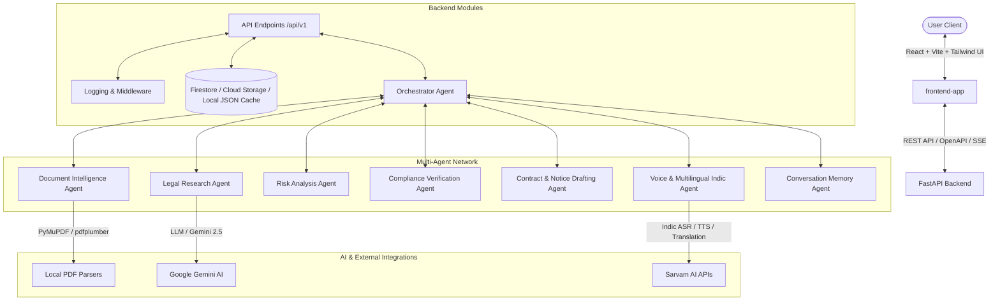

# LawGPT AI OS ⚖️🤖

> **MOONSHOT Buildathon Submission** — An autonomous, multi-agent AI Operating System for legal intelligence, document understanding, compliance verification, and multilingual voice interaction.

---

## 🏛️ System Architecture

LawGPT AI OS is built as a decoupled, modern legal engineering platform:



---

## 📂 Project Directory Structure

```text
lawgpt-moonshot/
├── backend/               # FastAPI Backend Service
│   ├── app/
│   │   ├── agents/        # Orchestrator & Specialized Domain Sub-Agents
│   │   ├── api/           # Versioned API routes (/api/v1)
│   │   ├── core/          # App configuration, security, exception handling, logging
│   │   ├── database/      # Firestore & Cloud Storage connection clients (with local JSON fallbacks)
│   │   ├── services/      # Service integration layers (Gemini, RAG, Sarvam AI, PDF)
│   │   └── main.py        # Application startup & middleware configuration
│   ├── data/              # Local data storage, document metadata & vector fallbacks
│   ├── tests/             # Comprehensive Pytest suite
│   ├── Dockerfile         # Production container build
│   └── requirements.txt   # Backend Python dependencies
├── frontend-app/          # React + Vite + TypeScript + Tailwind CSS Frontend
│   ├── src/
│   │   ├── components/    # Reusable UI component library (shadcn/ui inspired)
│   │   ├── pages/         # Page views (Dashboard, Assistant, Documents, Research, etc.)
│   │   ├── services/      # Client-side API orchestration & state management
│   │   └── utils/         # API Client & streaming utilities
│   └── package.json       # Frontend dependencies & scripts
├── docs/                  # Architectural documentation & technical specs
└── docker-compose.yml     # Workspace orchestration file
```

---

## 🚀 Getting Started

### Prerequisites
- **Python 3.11+** or **Python 3.12+**
- **Node.js 18+** / **npm** / **bun**
- **Docker** and **Docker Compose** (optional)

---

### 1. Backend Setup

1. Navigate to the backend directory:
   ```bash
   cd backend
   ```
2. Create and activate a Python virtual environment:
   ```bash
   python3 -m venv .venv
   source .venv/bin/activate
   ```
3. Install the dependencies:
   ```bash
   pip install -r requirements.txt
   ```
4. Copy the environment configuration file:
   ```bash
   cp .env.example .env
   ```
   *Edit `.env` to configure your API keys (e.g. `GEMINI_API_KEY`, `SARVAM_API_KEY`). The system includes local JSON fallbacks for offline development.*

5. Run development server:
   ```bash
   uvicorn app.main:app --reload --port 8000
   ```
   *The Swagger UI documentation is available at [http://localhost:8000/docs](http://localhost:8000/docs).*

---

### 2. Frontend Setup

1. Navigate to the frontend directory:
   ```bash
   cd frontend-app
   ```
2. Install package dependencies:
   ```bash
   npm install
   ```
3. Copy the environment configuration file:
   ```bash
   cp .env.example .env
   ```
   *Ensure `VITE_BACKEND_URL=http://127.0.0.1:8000/api/v1` is set.*

4. Start the Vite development server:
   ```bash
   npm run dev
   ```
   *The web portal will run on [http://localhost:8080](http://localhost:8080) or [http://localhost:5173](http://localhost:5173).*

---

### 3. Docker Compose Setup (Full Stack)

Build and run both services together from the root of the workspace:
```bash
docker compose up --build
```

---

## 🛣️ API Endpoints Summary

All routes are versioned under `/api/v1`:

- **System Health**:
  - `GET /api/v1/health` - Check API and environment configuration.
  - `GET /api/v1/ready` - Verify database and cloud service connectivity.
  - `GET /api/v1/live` - Verify engine liveness.
  - `GET /api/v1/version` - Retrieve application details.

- **Modular Domain Agents**:
  - `GET /api/v1/agents` - Query registered sub-agent metadata and capabilities.
  - `POST /api/v1/chat` - Interact with the Orchestrator Chat Agent.
  - `POST /api/v1/document/analyze` - Upload and analyze legal documents.
  - `POST /api/v1/document/compare` - Compare two legal agreements.
  - `POST /api/v1/research/query` - Perform legal query research tasks.
  - `POST /api/v1/compliance/verify` - Verify regulatory compliance.
  - `POST /api/v1/draft/generate` - Draft legal letters, notices, and contracts.
  - `POST /api/v1/voice/transcribe` - Transcribe voice clips or translate text.
  - `POST /api/v1/knowledge/ingest` - Ingest legal documents into vector storage.

For detailed architecture guides, refer to:
- [Document Ingestion Guide](docs/document_ingestion.md)
- [Orchestrator Guide](docs/orchestrator.md)
- [Voice Agent Integration](docs/voice_agent.md)
- [Compliance Agent Guide](docs/compliance_agent.md)

---

## 🛠️ Verification & Quality Assurance

- **Run Type Checks**:
  ```bash
  mypy backend
  ```
- **Run Style Linters**:
  ```bash
  ruff check backend/app
  ```
- **Run Backend Tests**:
  ```bash
  pytest backend/tests/
  ```
- **Run Frontend Build**:
  ```bash
  cd frontend-app && npm run build
  ```
