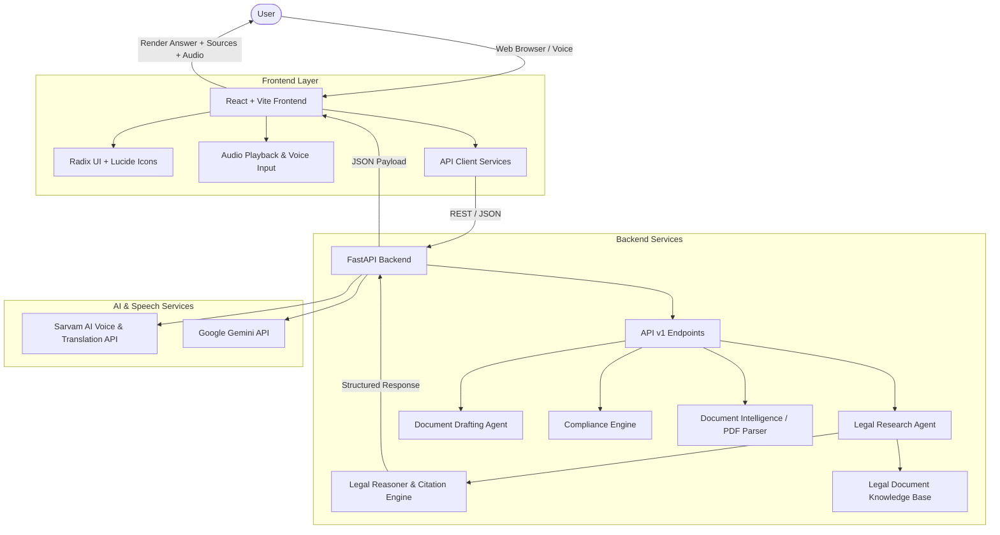

# LawGPT Moonshot

An AI-powered legal assistant that helps users understand, research, analyze, and work with legal information through clear, accessible AI-powered interactions.

---

## Overview

Legal information is often dense, statutory, and difficult for non-lawyers and businesses to interpret quickly. Finding relevant provisions, verifying citations, and extracting actionable obligations typically requires navigating through hundreds of pages of gazetted acts and legal documents.

**LawGPT Moonshot** bridges this gap by providing an intelligent legal operating system. It translates complex statutory frameworks, bare acts, and contracts into clear, structured, and easy-to-understand explanations—backed by exact legal provisions, verified document citations, and actionable risk assessments.

> **Disclaimer**: LawGPT Moonshot is designed for general legal understanding, research, and productivity assistance. It is not a substitute for formal legal representation or professional legal advice.

---

## Key Features

### 1. 🔍 AI Legal Search & Conversational Q&A
- **Direct Answers First**: Gives an immediate, plain-language answer to user queries (e.g., freedom of speech, data protection rules, employee termination rights) without raw text dumps.
- **Structured Legal Basis**: Explicitly lists governing Articles, Acts, and Sections (e.g., *Article 19(1)(a) read with Article 19(2), Constitution of India*).
- **Verified Sources & Metadata**: Displays exact document names, PDF file references, page numbers, years, and chapter provisions.
- **Why This Source Matters**: Provides a concise rationale explaining why the cited authority governs the specific question.
- **Important Notes & Caveats**: Highlights statutory restrictions, exceptions, and procedural boundaries.
- **In Simple Legal Terms**: Concludes with a short takeaway blockquote for instant comprehension.

### 2. 📑 Document Intelligence & Analysis
- **Contract & Document Upload**: Upload legal agreements, petitions, and notices in PDF format.
- **Clause Extraction & Risk Scoring**: Automatically extracts key clauses, liabilities, indemnity caps, and termination provisions.
- **Compliance Summaries**: Highlights high-risk ambiguities and non-standard contract clauses.

### 3. ✍️ AI Document Drafting
- **Template-Driven Generation**: Generate customized legal documents including Non-Disclosure Agreements (NDAs), Employment Contracts, Legal Notices, and Consultancy Agreements.
- **Dynamic Variable Injection**: Fill parties, governing law, jurisdiction, and clause terms with live document preview and PDF export.

### 4. 🛡️ Regulatory Compliance Checker
- **Statutory Risk Auditing**: Evaluate business policies and workflows against major regulatory frameworks such as the **Digital Personal Data Protection Act (DPDP Act, 2023)**, **Companies Act, 2013**, and **Industrial Disputes Act, 1947**.
- **Remediation Steps**: Generates clear checklists to mitigate exposure to regulatory penalties and litigation.

### 5. 🎙️ Indic Voice Assistant & Multilingual Translation
- **Hands-Free Voice Interaction**: Query the legal assistant via microphone input powered by speech recognition.
- **Audio Playback (TTS)**: Listen to legal answers read aloud with natural speech synthesis.
- **Multilingual Support**: On-demand translation of legal answers into Indian languages including Hindi (HI), Tamil (TA), Telugu (TE), and Bengali (BN).

### 6. ⚖️ Case Management & Litigation Tracking
- **Case Dashboard**: Organize active legal matters, tracking court jurisdictions, case numbers, hearing dates, and case stages.
- **Milestone Timelines**: Visual chronological progression of filings, orders, and upcoming court appearances.

---

## How It Works

```
User Query / Voice Input
          │
          ▼
Legal Intent & Semantic Retrieval
(Matches Statutes, Bare Acts & Documents)
          │
          ▼
Legal Reasoning Engine
(Synthesizes Direct Answer + Validates Provisions)
          │
          ▼
Structured Presentation
├── Plain-Language Answer
├── Governing Legal Basis (Act / Article / Section)
├── Verified Source (Document, PDF, Page, Year)
├── Why This Source Matters
├── Important Notes & Statutory Caveats
└── Audio Playback / Multilingual Translation
```

---

## User Experience

- **Dashboard**: Unified control center displaying active cases, document counts, compliance health, and quick-action shortcuts.
- **Legal Search**: Conversational ChatGPT-style card layout emphasizing direct answers, structured legal basis, and verified PDF source citations.
- **Documents**: Central repository for uploaded agreements with clause breakdown and risk indicators.
- **Document Drafting**: Step-by-step drafting wizard with real-time preview and export capabilities.
- **Compliance Checker**: Audit interface for evaluating business operations against statutory mandates.
- **Voice Assistant**: Integrated hands-free audio assistant for spoken legal queries.

---

## Technology Stack

### Frontend
- **Framework**: [React 18](https://react.dev/) + [Vite](https://vitejs.dev/)
- **Language**: TypeScript
- **Styling**: Vanilla CSS + Tailwind CSS utilities
- **UI Components**: Radix UI Primitives, Lucide React Icons
- **Animations & Smooth Scroll**: Framer Motion, GSAP, Lenis
- **Notifications**: Sonner

### Backend
- **Framework**: [FastAPI](https://fastapi.tiangolo.com/) (Python 3.14 / 3.11+)
- **Server**: Uvicorn (ASGI)
- **Data Validation & Settings**: Pydantic v2, Pydantic Settings
- **Document Processing**: PyPDF, PDFPlumber
- **HTTP Client**: HTTPX

### AI & Speech Services
- **Indic Voice & Translation**: [Sarvam AI](https://sarvam.ai/) (Saaras STT, Bulbul TTS, Mayura / Sarvam-Translate)
- **Language Intelligence & Supplemental Embeddings**: Google Gemini API
- **Deterministic Legal Reasoner**: Rule-grounded statutory reasoner for consistent, citation-verified outputs

### Deployment & DevOps
- **Frontend Hosting**: Vercel (Single Page Application configuration via `vercel.json`)
- **Containerization**: Docker, Docker Compose

---

## Architecture



---

## Getting Started

### Prerequisites
- Node.js 18+ and npm / pnpm
- Python 3.11+

### 1. Clone the Repository
```bash
git clone https://github.com/nitesh-20/lawgpt-moonshot.git
cd lawgpt-moonshot
```

### 2. Backend Setup
```bash
cd backend
python3 -m venv .venv
source .venv/bin/activate
pip install -r requirements.txt
cp .env.example .env
uvicorn app.main:app --port 8000 --reload
```

### 3. Frontend Setup
```bash
cd ../frontend-app
npm install
cp .env.example .env
npm run dev
```

The application will be accessible at `http://localhost:5173` (or `http://localhost:8083`).

---

## License

This project is licensed under the MIT License.
