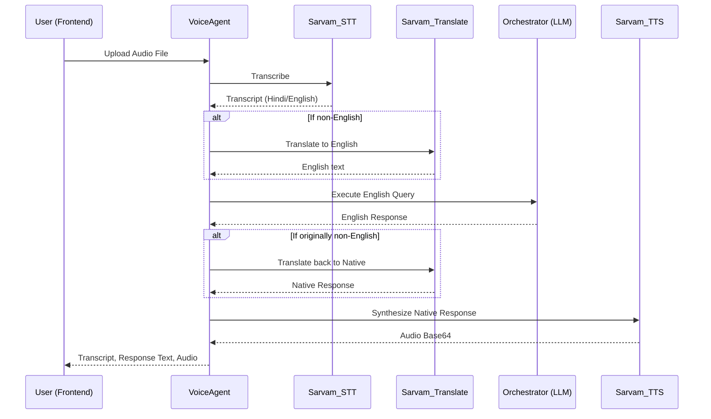
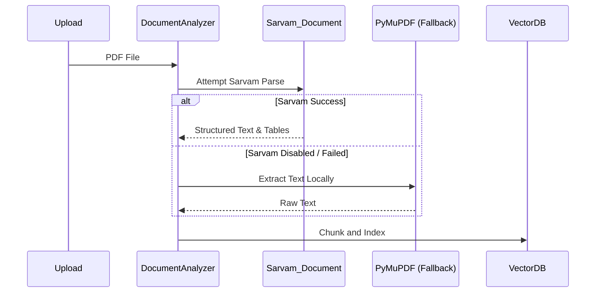

# Sarvam AI Integration Architecture

## Overview
LawGPT AI OS deeply integrates the **Sarvam AI Platform** as a first-class capability to provide localized, multilingual legal intelligence. The integration encompasses Speech-to-Text (STT), Text-to-Speech (TTS), Indic Translation, and structural Document Intelligence.

This document outlines the architecture, configuration, API consumption rules, and the built-in intelligent failover mechanism designed to preserve API credits and guarantee system stability.

---

## 1. Architecture Modules
The Sarvam integration is strictly encapsulated within `backend/app/services/sarvam/` to ensure no vendor lock-in leaks into the core orchestration layers.

- **`config.py`**: Manages the `SARVAM_ENABLED` feature flag and API key validation. Responsible for globally disabling Sarvam at runtime if a `402 Quota Exhausted` is encountered.
- **`client.py`**: A unified `httpx.AsyncClient` wrapper that standardizes timeouts, headers, and centralizes error interception.
- **`speech.py`**: Interfaces with Sarvam's `/speech-to-text-translate` endpoint, specifically tailored for Indian accents and languages.
- **`tts.py`**: Interfaces with Sarvam's `/text-to-speech` endpoint (Bulbul v3). Utilizes MD5-based local caching to prevent redundant syntheses of the same AI response.
- **`translate.py`**: Interfaces with Sarvam's translation endpoint (Mayura v1), providing seamless runtime translation for both inputs and outputs.
- **`document.py`**: Connects to Sarvam's OCR and Document Parsing pipelines to extract structured elements (tables, headers) before chunking them into the Vector Database.

---

## 2. Configuration & Feature Flags

Sarvam is controlled entirely via environment variables. Keys must never be hardcoded or exposed to the frontend.

| Variable | Description | Default |
| :--- | :--- | :--- |
| `SARVAM_ENABLED` | Feature flag to enable/disable all Sarvam pipelines. | `True` |
| `SARVAM_API_KEY` | Your Sarvam API authentication token. | *None* |
| `SARVAM_BASE_URL` | The REST API base URL. | `https://api.sarvam.ai` |
| `SARVAM_TIMEOUT` | Max timeout in seconds for API requests. | `30.0` |

### Graceful Degradation Strategy
The system actively guards against crashes. 
1. If `SARVAM_ENABLED=False` or `SARVAM_API_KEY` is missing/invalid, the modules will instantly return error dicts. 
2. The core agents (`voice_agent.py`, `analyzer.py`) catch these errors and instantly switch to local Fallback Pipelines (e.g., PyMuPDF for documents, default LLM logic for language handling).

---

## 3. Flow Diagrams

### Voice Chat Workflow

### Document Intelligence Workflow

---

## 4. Frontend Integration

Sarvam capabilities are deeply embedded in the React UI:
- **Chatbot.tsx**: Displays an interactive `Volume/Play` icon next to assistant messages for on-demand Text-To-Speech (preventing auto-play credit drains). Users can stop, pause, or download the audio.
- **DocumentIntelligence.tsx**: Includes a `Translate` dropdown on parsed legal clauses, enabling immediate Indic language translation of complex legal jargon and AI risk summaries.

---

## 5. Troubleshooting

- **Audio Playback Fails in Chat**: Ensure `SARVAM_ENABLED` is `true`. Check the backend logs for `402 Quota Exhausted`. 
- **Documents Not Parsing via Sarvam**: The `/document/parse` endpoint usage depends on specific Sarvam enterprise tiers. If the request fails, the application falls back to `PyMuPDF`. Check `local_analysis_store.json` or Firebase to see the `confidence_score` (Sarvam yields higher confidence due to OCR).
- **Console Log: "Sarvam AI integration has been gracefully disabled"**: This occurs dynamically when the `client.py` catches a `401` or `402` HTTP error from Sarvam. To re-enable, restart the backend server after fixing the API key/billing issue.
