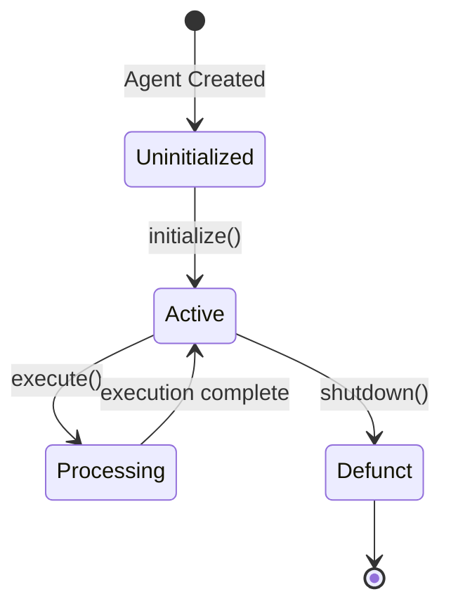
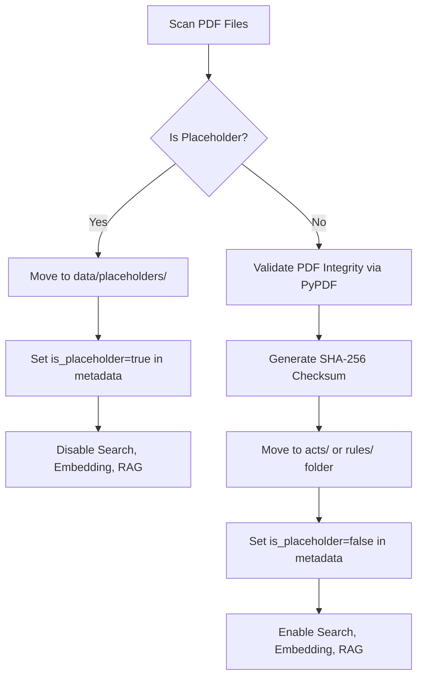
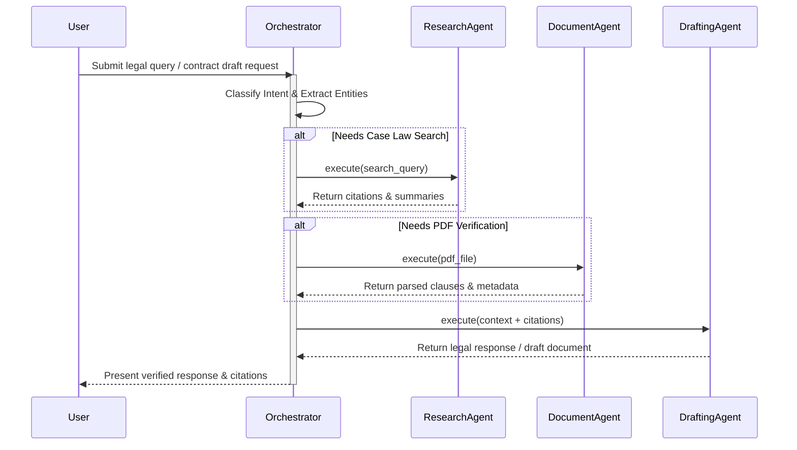

# LawGPT AI OS: Backend Architecture & Integration Guide

This document provides a comprehensive technical overview of the LawGPT AI OS backend. It acts as the single source of truth for engineering teams joining the project, detailing how components interact, the request and agent lifecycles, database structures, and RAG pipeline configurations.

---

## 1. High-Level Architecture

LawGPT AI OS is built using **Clean Architecture** and **SOLID design principles**, isolating business logic from external frameworks, databases, and APIs.

```mermaid
graph TD
    subgraph Client Layer
        Web[Web Frontend / React]
        Mobile[Mobile Frontend / React Native]
    end

    subgraph API Gateway / Presentation Layer
        FastAPI[FastAPI Web Server]
        Middleware[Cors / Gzip / RateLimit Middleware]
    end

    subgraph Business Logic / Domain Layer
        Orch[Orchestrator Agent]
        DocAgent[Document Agent]
        ResAgent[Research Agent]
        DraftAgent[Drafting Agent]
        RiskAgent[Risk Agent]
    end

    subgraph Data & Services / Infrastructure Layer
        Firestore[Google Cloud Firestore]
        Storage[Cloud Storage]
        Sarvam[Sarvam AI translation / Audio]
        Gemini[Google Gemini LLM Client]
        RAG[RAG Vector Database]
    end

    Client Layer --> API Gateway / Presentation Layer
    API Gateway / Presentation Layer --> Business Logic / Domain Layer
    Business Logic / Domain Layer --> Data & Services / Infrastructure Layer
```

- **Presentation Layer (FastAPI)**: Defines routers, validates incoming request parameters using Pydantic, and handles HTTP exceptions.
- **Domain Layer (Agents & Orchestrator)**: Implements base interfaces and state coordination.
- **Infrastructure Layer (Services)**: Handles database connections (Firestore), object storage (Cloud Storage), and external AI model APIs (Gemini, Sarvam).

---

## 2. Request Lifecycle

The backend handles requests through a standardized, synchronous-to-asynchronous lifecycle to guarantee reliability and low latency:

```text
[Client Request]
       │
       ▼
┌────────────────────────────────────────────────────────┐
│ 1. Middleware Chain (CORS, GZip, Exception Handler)    │
└────────────────────────────────────────────────────────┘
       │
       ▼
┌────────────────────────────────────────────────────────┐
│ 2. FastAPI Router Endpoint Validation (Pydantic v2)   │
└────────────────────────────────────────────────────────┘
       │
       ▼
┌────────────────────────────────────────────────────────┐
│ 3. Dependency Injection (DB instances, Session resolved)│
└────────────────────────────────────────────────────────┘
       │
       ▼
┌────────────────────────────────────────────────────────┐
│ 4. Orchestrator Task Dispatch (Asynchronous spawn)    │
└────────────────────────────────────────────────────────┘
       │
       ▼
┌────────────────────────────────────────────────────────┐
│ 5. Response Serialization (Custom JSON Encoder)       │
└────────────────────────────────────────────────────────┘
       │
       ▼
[Client Response]
```

---

## 3. Agent Lifecycle

Every AI agent in LawGPT AI OS extends the `BaseAgent` abstract class, which enforces strict lifecycle rules:



- **`initialize()`**: Load configuration files, establish API client connections, and preload local vector models.
- **`execute(task_input)`**: Run stateless domain logic (e.g., scanning document files, querying vector databases).
- **`shutdown()`**: Release file handles, close HTTP clients, and flush memory logs.
- **`health()`**: Return structural diagnostics for status endpoints.

---

## 4. Document Ingestion Pipeline

The document ingestion pipeline processes legal PDFs and registers them in the system. It enforces a strict isolation policy between **Authentic Documents** and **Fallback Placeholders**.



---

## 5. RAG Pipeline

The Retrieval-Augmented Generation (RAG) pipeline is guarded by a metadata check to ensure placeholder documents are never ingested:

```python
# Ingestion Exclusion Logic
async def process_document(self, doc_id: str, text: str):
    if self.rag_service.is_placeholder_document(doc_id):
        logger.warning(f"Excluding placeholder document from RAG: {doc_id}")
        return
    
    # 1. Chunk document
    chunks = await self.rag_service.chunk_document(text, doc_id)
    # 2. Generate vector embeddings
    for chunk in chunks:
        vector = await self.rag_service.generate_embedding(chunk, doc_id)
        # 3. Insert into Vector Database
        await self.vector_db.insert(doc_id, chunk, vector)
```

---

## 6. Firestore Database Schema

Firestore acts as the system database for user logs, chat histories, agent memory configurations, and document manifests.

```text
/users/{user_id}/
   ├── email: "user@domain.com"
   ├── created_at: Timestamp
   │
   └── /conversations/{conversation_id}/
          ├── title: "Property dispute consultation"
          ├── updated_at: Timestamp
          │
          └── /messages/{message_id}/
                 ├── sender: "user" | "assistant"
                 ├── text: "What are the rules under the RERA act?"
                 ├── timestamp: Timestamp
                 └── citations: ["rera-act-2016"]

/knowledge_base_manifest/
   └── /document_id/
          ├── title: "Code of Civil Procedure"
          ├── category: "acts/cpc"
          ├── checksum: "sha256_hash_here"
          ├── is_placeholder: false
          ├── priority: "high"
          └── status: "active"
```

---

## 7. Memory Architecture

LawGPT uses a dual-buffer memory schema to optimize LLM context window usage:

1. **Short-Term Memory**:
   - Stores the current conversation thread (sliding window buffer of the last 10 messages).
   - Saved in Firestore under the sub-collection `/messages/` and loaded dynamically.
2. **Long-Term Memory**:
   - Stores user preferences, recurring legal query profiles, and summarized case history files.
   - Compiled asynchronously and indexed in vector storage for cross-session retrieval.

---

## 8. Orchestrator Decision Flow

The Orchestrator coordinates agent tasks, delegating sub-problems to specialized modules based on the user's intent:



---

## 9. External Services Integration

### Sarvam AI Integration
- **Translation Services**: Translates input legal queries from regional Indian languages (Hindi, Tamil, Telugu, etc.) to English before processing, and translates responses back to the target language.
- **Text-to-Speech (TTS) / Speech-to-Text (STT)**: Enables voice interface interactions using Sarvam's speech models.

### Gemini LLM Integration
- **Google Gemini Client**: Generates legal analyses, drafts, and reasons over retrieval context. Calls utilize structured prompt interfaces (System Instructions) with strict temperature bounds ($0.0 - 0.2$) for factual correctness.

---

## 10. Security & Error Handling

> [!IMPORTANT]
> The backend enforces strict safety measures to prevent sensitive credential exposures and handle infrastructure downtime gracefully.

### Security Controls
- **Firebase Keys**: `serviceAccountKey.json` is explicitly ignored by both root and backend `.gitignore` rules.
- **WAF Rules**: Handles rate-limiting and blocks direct headless scripts attempting scraping.
- **CORS Protection**: Access to the FastAPI endpoints is restricted to configured domain origins.

### Exception Hierarchies
- **`LawGPTException` (Base)**: Custom application error containing metadata dictionaries.
  - **`DatabaseConnectionError`**: Thrown if connection to Firestore fails.
  - **`LLMApiError`**: Thrown if Gemini or Sarvam APIs return timeouts or error responses.
  - **`DocumentParsingError`**: Thrown if a PDF is corrupted or unreadable.

---

## 11. Folder Responsibilities

```text
backend/
├── app/
│   ├── agents/          # Core Agent implementations (Orchestrator, Research, Drafting, Document, Memory)
│   ├── api/             # FastAPI presentation layer (V1 endpoints, schemas, dependency injectors)
│   ├── core/            # Application config, logger middleware, exception hooks
│   ├── database/        # Firestore client connection and query builders
│   └── services/        # Third-party integrations (Gemini, Sarvam) and utility services (PDF, RAG)
├── data/                # Ingestion database registry (Manifests, Reports, Active PDFs, Placeholders)
└── tests/               # PyTest suite validating routing, startup lifecycles, and configuration files
```

---

## 12. Future Roadmap

1. **Local Vector Database Deployment**: Move from in-memory index queries to a dedicated containerized vector store (such as Qdrant or PgVector).
2. **Scanned PDF Support (OCR)**: Integrate local Tesseract OCR or Google Document AI parser to digitize scanned legal documents.
3. **Multi-Agent Parallelism**: Update Orchestrator task execution from sequential sequences to concurrent parallel calls using Python's `asyncio.gather`.
