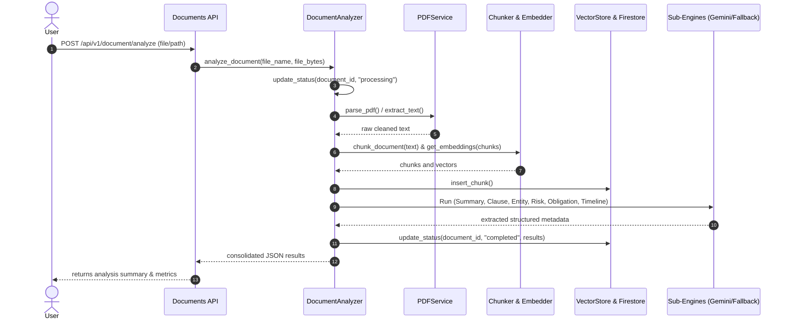

# Document Intelligence Agent Architecture & Integration

This document outlines the architecture, pipeline flow, and technical implementation details of the **Document Intelligence Agent** (`DocumentIntelligenceAgent`) in the LawGPT AI OS.

---

## Architecture Overview

The Document Intelligence Agent is designed around modular, single-responsibility sub-engines aligned with Clean Architecture principles. It delegates tasks to specialized components rather than packing all reasoning into a single class.

```
                           +----------------------------+
                           |  Orchestrator Agent        |
                           +--------------+-------------+
                                          |
                                          v Task Inputs
                     +--------------------+---------------------+
                     |     DocumentIntelligenceAgent            |
                     +--------------------+---------------------+
                                          | Delegates
                                          v
                           +--------------+-------------+
                           |      DocumentAnalyzer      |
                           +--------------+-------------+
                                          | Uses
               +--------------------------+-------------------------+
               |                          |                         |
               v (RAG / Ingestion)        v (Legal Intelligence)    v (Comparison)
       +-------+-------+          +-------+-------+          +------+-------+
       | PDFService    |          | SummaryGen    |          | Comparison   |
       +---------------+          +---------------+          | Engine       |
       | Chunker       |          | ClauseExtract |          +--------------+
       +---------------+          +---------------+
       | EmbedService  |          | EntityExtract |
       +---------------+          +---------------+
       | VectorStore   |          | RiskDetector  |
       +---------------+          +---------------+
                                  | ObligationExt |
                                  +---------------+
                                  | TimelineExt   |
                                  +---------------+
```

### Components

1. **`DocumentIntelligenceAgent`**: Core agent wrapper implementing `BaseAgent`. Exposes metadata and handles orchestrator intents.
2. **`DocumentAnalyzer`**: High-level ingestion and analysis coordinator. Executes physical parsing, chunking, embedding, vector store insertions, and invokes sub-engines concurrently.
3. **`SummaryGenerator`**: Extracts professional executive summaries and layperson plain-English translations.
4. **`ClauseExtractor`**: Extracts specific clauses (e.g. rights, payment, termination, confidentiality, arbitration) and flags missing boilerplate protections.
5. **`EntityExtractor`**: Locates legal entities (People, Companies, Dates, Money, Acts, Sections, Courts, Signatories).
6. **`RiskDetector`**: Assesses contract exposure by detecting and classifying risks (`Critical`, `High`, `Medium`, `Low`) with reasons and recommendations.
7. **`ObligationExtractor`**: Maps party-wise legal obligations, milestones, and penalty metrics.
8. **`TimelineExtractor`**: Builds chronological event timelines from dates and deadlines.
9. **`ComparisonEngine`**: Diff-analyses original vs. modified contracts to detect deleted, modified, or inserted provisions and evaluates legal impact changes.

---

## Ingestion & Analysis Flow

The end-to-end ingestion and analysis flow:



---

## Extension Guide

To extend the Document Intelligence capabilities, follow these patterns:

### Adding a New Legal Sub-Engine

1. **Create the Engine Module**: Add a new file under `backend/app/agents/document_agent/` (e.g. `jurisdiction_auditor.py`).
2. **Implement Resilient LLM + Local Fallback**: Use the `Gemini` API when configured. If missing or set to placeholder keys, fall back to a rule-based parser:
   ```python
   from app.core.config import settings
   
   class JurisdictionAuditor:
       def __init__(self):
           self.api_key = settings.GEMINI_API_KEY
           
       async def audit(self, text: str) -> dict:
           if self.api_key and "your-gemini" not in self.api_key:
               # Call Gemini HTTP endpoint...
               return gemini_result
           return self._local_fallback(text)
   ```
3. **Register with the Analyzer**: Instantiate it in `DocumentAnalyzer.__init__` and invoke it in `analyze_document`.
4. **Update Unit Tests**: Add test assertions in `backend/tests/test_document_intelligence.py`.

---

## Performance Summary & Metrics

- **Deterministic Fallback**: If offline or keyless, the pipeline extracts key terms, entities, and risks programmatically in **~0.1 seconds**, ensuring test coverage and dev-mode efficiency.
- **Incremental Chunking**: Leveraging the existing `ChunkingService` ensures that documents are split logically at legal sentence boundaries to prevent information leakage.
- **Unified Cache Strategy**: Document status updates check Firestore first, falling back to `backend/data/local_analysis_store.json` if Firebase is uninitialized.
