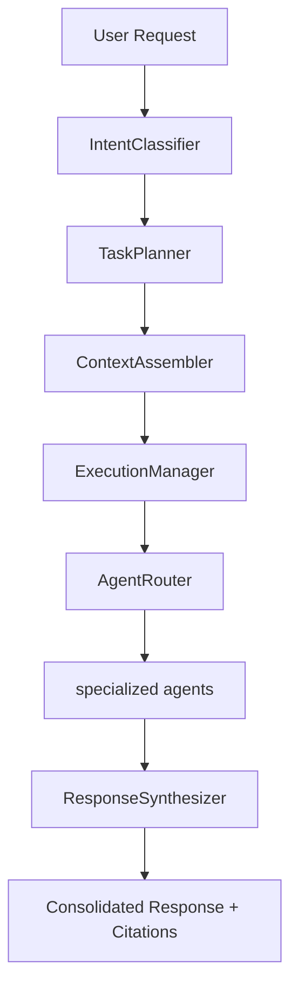
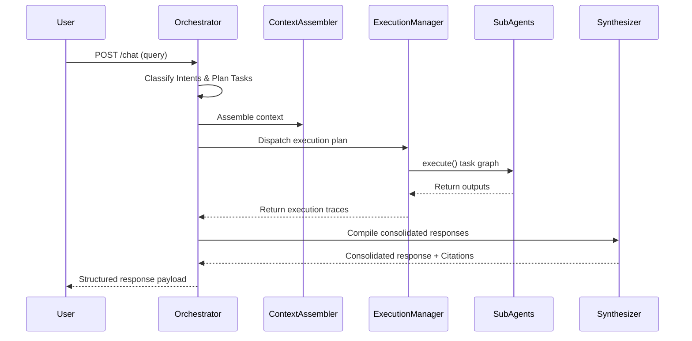

# LawGPT AI OS: Autonomous Orchestrator Guide

This document describes the design, execution workflows, memory lifecycles, and API endpoints of the central Orchestrator Agent.

---

## 1. Architecture

The Orchestrator acts as the central cognitive processor of LawGPT AI OS. It decouples incoming queries from direct execution, compiling plans dynamically and dispatching them to specialized child agents:

---

## 2. Dynamic Planning & Routing

1. **Intent Classification**: Evaluates multi-intent queries to locate child targets.
2. **Execution Graph Planning**: Determines execution dependencies. Sequential pipelines run if a task requires previous outputs (e.g. Drafting depends on Research), otherwise tasks run concurrently in parallel.
3. **Registry-based Routing**: Registers sub-agents with versions, capabilities, health logs, and priority indexes. The best candidate receives the task payload.

---

## 3. Memory & Context Assembly

- **Short-Term Dialog Memory**: Sliding buffer slicing the last 10 messages.
- **Session Memory**: Key/value properties persisting query parameters.
- **Execution Memory**: Real-time diagnostic traces logging run details.
- **Context Assembly**: Compiles dialogue logs, RAG search chunks, and subtask execution history into a single object.

---

## 4. API Reference

All endpoints are mounted under `/api/v1/orchestrator`:

- **`POST /chat`**: Coordinates the intent-execution loop, returning final answers with citations.
- **`POST /plan`**: Visualizes intent classification mapping and execution graph splits.
- **`GET /status`**: Health summary of the orchestrator and all child sub-agents.
- **`GET /agents`**: Lists capabilities, version signatures, and priority weights of registered agents.
- **`GET /metrics`**: Observability logs tracking execution time durations.

---

## 5. Sequence Diagram

