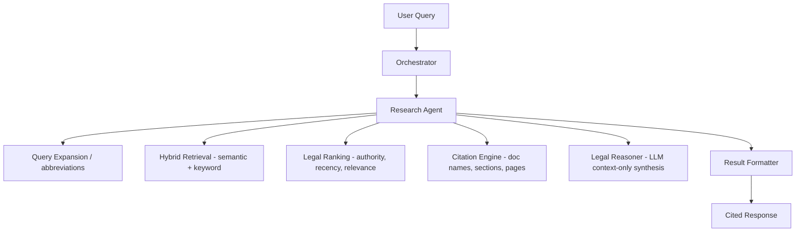

# Legal Research Agent

The **Legal Research Agent** is a production-grade component of LawGPT AI OS designed to perform indic legal research, parse acts, sections, case laws, and generate structured citations with confidence scoring.

---

## Workflow Architecture



1. **Intent Understanding & Query Expansion**:
   Recognizes common abbreviations (e.g. IPC, BNS, DPDP, GST, IT Act) and extracts referenced sections or articles.
2. **Hybrid Retrieval**:
   Uses semantic embedding cosine similarity and keyword token overlap across the Firestore index or local vector store fallback.
3. **Legal Ranking & Deduplication**:
   Prioritizes high-authority documents (e.g., Constitution > central acts > rules), matches targets with query jurisdictions, applies boosts for recency (newer enactments BNS/DPDP), and filters out identical chunks.
4. **Citation Extraction**:
   Formats legal citations containing the document name, section number, page number, relative source path, and calculated confidence score.
5. **Legal Reasoning**:
   Queries Gemini models (or falls back to a deterministic local syntactic synthesizer if API keys are inactive) to answer using *only* retrieved context.
6. **Result Formatting**:
   Outputs the structured schema (Summary, Detailed Explanation, Applicable Law, Relevant Sections, Related Acts, References, and Confidence Score).

---

## API Documentation

### 1. Execute Research Query
- **Endpoint**: `POST /api/v1/research/query`
- **Request Body**:
  ```json
  {
    "query": "What is the punishment for murder under section 302 of IPC?",
    "session_id": "session_abc",
    "filters": {
      "jurisdiction": "Supreme Court"
    }
  }
  ```
- **Response Body**:
  ```json
  {
    "status": "success",
    "message": "Summary string...",
    "agent": "ResearchAgent",
    "data": {
      "Summary": "Brief overview...",
      "Detailed Explanation": "In-depth explanation...",
      "Applicable Law": "Indian Penal Code",
      "Relevant Sections": ["Section 302 of Indian Penal Code"],
      "Related Acts": ["Indian Penal Code"],
      "References": ["Indian Penal Code, Section 302 (Page 10)"],
      "Confidence Score": 0.94,
      "citations": [
        {
          "document_id": "indian_penal_code",
          "document_name": "Indian Penal Code",
          "section": "302",
          "page_number": 10,
          "source_path": "ipc.pdf",
          "citation_text": "Indian Penal Code, Section 302 (Page 10)",
          "confidence_score": 0.94
        }
      ]
    },
    "metrics": {
      "execution_time_sec": 0.12,
      "confidence_score": 0.94,
      "chunks_retrieved": 1,
      "citations_count": 1
    }
  }
  ```

### 2. Retrieve Query History
- **Endpoint**: `GET /api/v1/research/history`
- **Response**: List of logged research operations saved locally.

### 3. Retrieve Usage Statistics
- **Endpoint**: `GET /api/v1/research/statistics`
- **Response**:
  ```json
  {
    "total_queries": 15,
    "average_confidence": 0.88,
    "average_execution_time_sec": 0.24,
    "most_queried_acts": [
      { "act": "Indian Penal Code", "count": 10 }
    ],
    "most_queried_sections": [
      { "section": "Section 302 of Indian Penal Code", "count": 8 }
    ]
  }
  ```

---

## Verification & Tests

A complete automated unit testing suite is provided in `backend/tests/test_research.py`.

To run the tests:
```bash
cd backend
.venv/bin/pytest tests/test_research.py
```
